<p align="center">
  
</p>

# OTAsync - OEM Dashboard

Welcome to the OTAsync OEM Dashboard repository. This project is part of the Firmware System: Empowering Wireless Diagnostic and Over the Air Updates initiative. This repository contains the codebase for the OEM web application which interacts with the backend server and vehicles to manage firmware updates and wireless diagnostics.

<p align="center">
  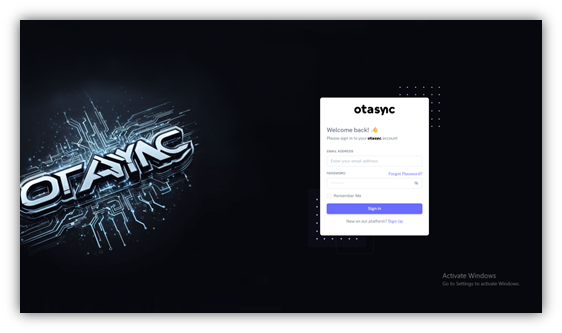
  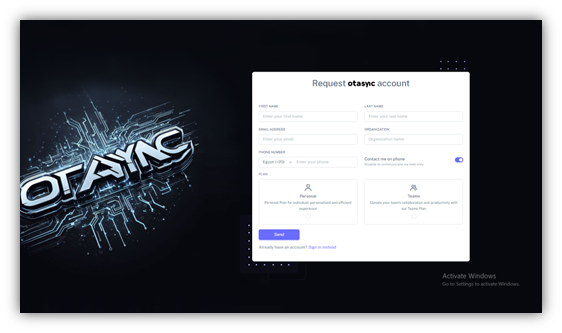
</p>

## Table of Contents

- [About the Project](#about-the-project)
- [Key Features](#key-features)
- [System Architecture](#system-architecture)
- [Getting Started](#getting-started)
  - [Prerequisites](#prerequisites)
  - [Installation](#installation)
  - [Configuration](#configuration)
- [Usage](#usage)
- [Contributing](#contributing)
- [License](#license)
- [Contact](#contact)

## About the Project

The OTAsync OEM Dashboard is designed to provide a comprehensive interface for managing over-the-air (OTA) firmware updates and wireless diagnostics for vehicles. This project leverages the Laravel framework for backend development, MySQL for database management, and MQTT for communication with client HMI systems.

## Key Features

- **Firmware Updates**: Manage and deploy firmware updates to vehicles over the air.
- **Wireless Diagnostics**: Perform diagnostics on vehicles remotely.
- **User Management**: Admin interface for managing users and permissions.
- **Real-Time Notifications**: Receive real-time notifications and updates through MQTT messages.
- **Security**: Generate API keys for vehicles and deploy encryption (Hyperd Model).

  <p align="center">
      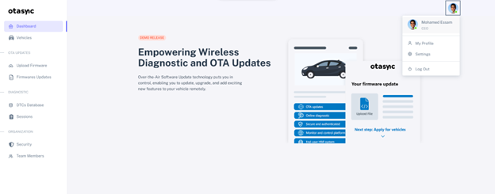
  </p>
  <p align="center">
      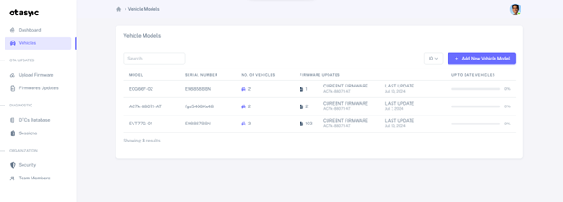
  </p>
  <p align="center">
      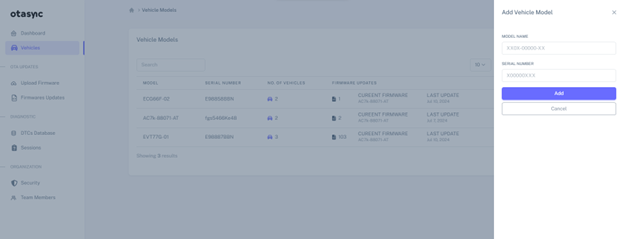
  </p>
  <p align="center">
      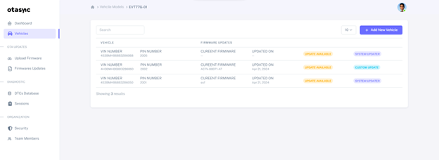
  </p>
  <p align="center">
      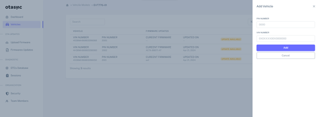
  </p>
  <p align="center">
      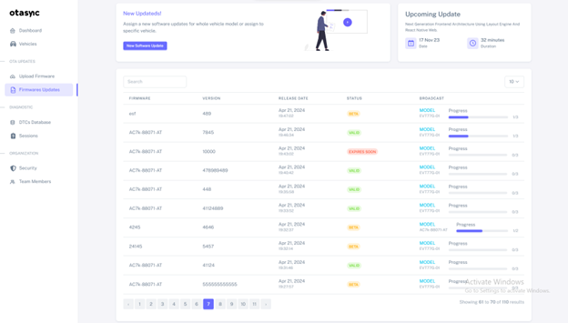
  </p>
  <p align="center">
      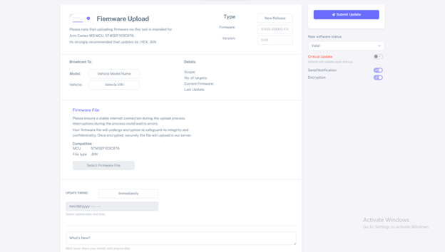
  </p>
  <p align="center">
      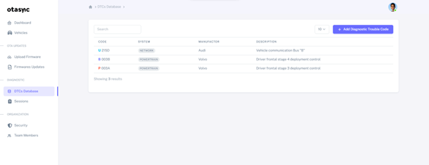
  </p>
  <p align="center">
      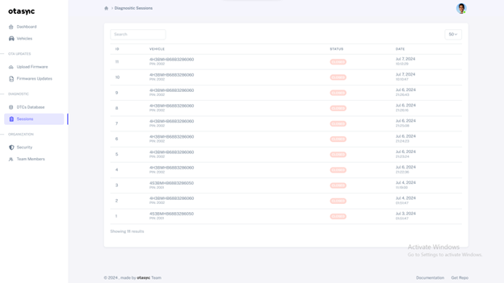
  </p>
  <p align="center">
      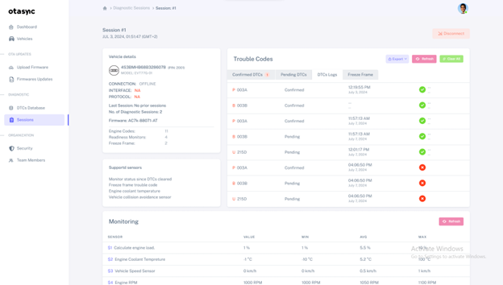
  </p>
  <p align="center">
      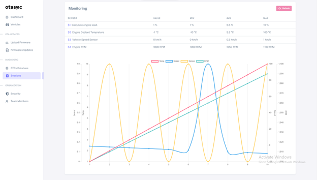
  </p>
  <p align="center">
      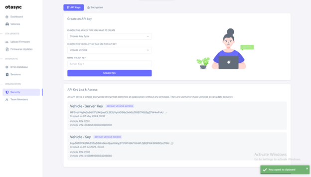
  </p>
  <p align="center">
      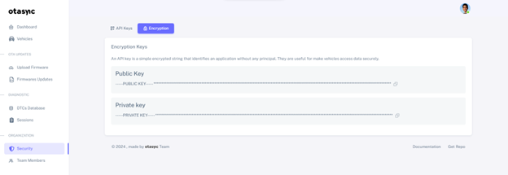
  </p>
  <p align="center">
      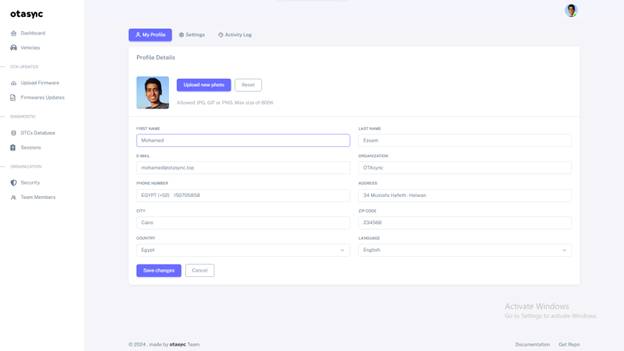
  </p>

## System Architecture

The system is divided into three main blocks:

1. **Backend Server**: The core of the system, handling API requests, database interactions, and MQTT communications.
2. **OEM Web Application**: The front-end interface for OEM users to interact with the system.
3. **Vehicles**: Equipped with a main ECU (Raspberry Pi) and target ECUs (STM), communicating with the backend server via MQTT.

## Getting Started

### Prerequisites

Ensure you have the following installed:

- PHP 8.x
- Composer
- MySQL
- Node.js and npm
- MQTT broker (e.g., HiveMQ)

### Installation

1. Clone the repository:
    ```sh
    git clone https://github.com/MohamedEssam70/OTAsync---OEM-Dashboard.git
    cd OTAsync---OEM-Dashboard
    ```

2. Install PHP dependencies:
    ```sh
    composer install
    ```

3. Install JavaScript dependencies:
    ```sh
    npm install
    ```

4. Set up the environment file:
    ```sh
    cp .env.example .env
    ```

5. Generate the application key:
    ```sh
    php artisan key:generate
    ```

6. Run the database migrations:
    ```sh
    php artisan migrate
    ```

### Configuration

Update the `.env` file with your configuration settings, including database connection details, MQTT broker details, and other environment-specific settings.

## Usage

To start the application:

```sh
php artisan serve
```
Visit http://localhost:8000 in your web browser to access the OEM Dashboard.

## Contributing
Contributions are welcome! Please follow these steps to contribute:

1. Fork the repository.
2. Create your feature branch:
   ```sh
   git checkout -b feature/YourFeature
   ```
3. Commit your changes:
   ```sh
   git commit -m 'Add some feature'
   ```
4. Push to the branch:
   ```sh
   git push origin feature/YourFeature
   ```
5. Open a pull request.

## License
This project is licensed under the MIT License.

## Contact
For any inquiries or issues, please contact Mohamed Essam at mohamedessam.engineer@gmail.com or m.essam@otasync.top.

Thank you for using the OTAsync OEM Dashboard!


